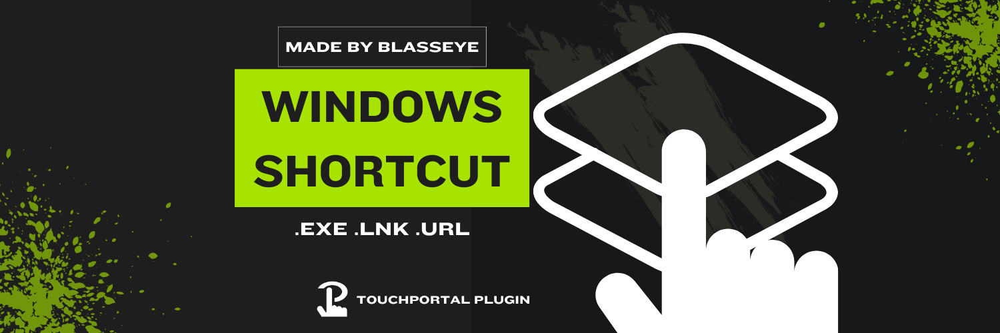

# TouchPortal-Windows-Shortcut

- [TouchPortal-Windows-Shortcut](#TouchPortal-Windows-Shortcut)
  - [Description](#Description)
  - [Badges](#Badges)
  - [Fonctionality](#Fonctionality)
    - [States](#States)
    - [Settings](#Settings)
  - [Installing](#Installing)
  - [Utilizing](#Utilizing)
  - [Bugs and Support](#bugs-and-suggestion)

# Description

TouchPortal-Windows-Shortcut plugin is a solution for easily retrieving the path to an application or shortcut, and the associated icon.

# Badges

# Fonctionality

## State

Currently there are 20 states corresponding to the path to the shortcut, and 20 other states corresponding to the path to the shortcut icon.
They are shaped like this:  
- [State] [Shortcut] Path of the shortcut icon n *TP.Plugins.win_shortcut.states.shortcut_icon_n*
- [State] [Shortcut] Path of the shortcut n *TP.Plugins.win_shortcut.states.shortcut_path_n*

## Settings

There are currently 3 settings for this plugin

* `Shortcut directory` - The path of the file where your shortcuts are located
    * Valid Values: A directory path. (ex: `C:\Users\user\Desktop\`)
* `Icon directory` - The path to the folder where application icons will be stored.
    * Valid Values: A directory path. (ex: `C:\Users\user\AppData\Roaming\TouchPortal\plugins\TPWinShortcut\`)
* `Refresh shortcut` - The time between each variable and icon update.
    * Default value: 120
    * Valid Values: An integer

# Installing

### Step 1: Download Plugin
Download the Touch Portal plugin from the [Releases](https://github.com/blasseye/TouchPortal-Windows-Shortcut/releases) section of this repository.

### Step 2: Import into Touch Portal
Select the Gear icon at the top of Touch Portal desktop window and select `Import plug-in...`.

### Step 3: Locate .tpp and Open
Navigate to where you downloaded the .tpp file from Step 1, select it and click "Open".

### Step 4: Select `Trust Always` on Warning Popup

In order for this plugin to run when you start Touch Portal, you will need to select `Trust Always` on the popup that appears, if you do not do this, it will show up every time you start Touch Portal.

### Step 5: Click `OK` on Popup

Once you trust the plugin, click `OK` button.

### Step 6: Set parameters and restart Touch Portal

After importing the plugin, go to settings and set the values for `Shortcut directory` and `Icon directory` (See the [Settings](#Settings) section for more information on how to modify these parameters.). Once configured, restart Touch Portal.

# Utilizing

To configure the button's appearance, go to General>Visuals and select the `Keep Buttons Icon same as File` event. You'll find the files you've created in the Configure folder under [Settings](#Settings). 
To configure the button action to launch the application, go to General>Run and Open and select the `Run a shortcut` action. Select the *path of the shortcut n* state.

# Bugs/Enhancements

Open an issue on github or join offical [TouchPortal Discord](https://discord.gg/touchportal) for support.

# Acknowledgements

Thanks to [KillerBOSS2019](https://github.com/KillerBOSS2019) for answering my questions, and helping me with this first TouchPortal plugin.